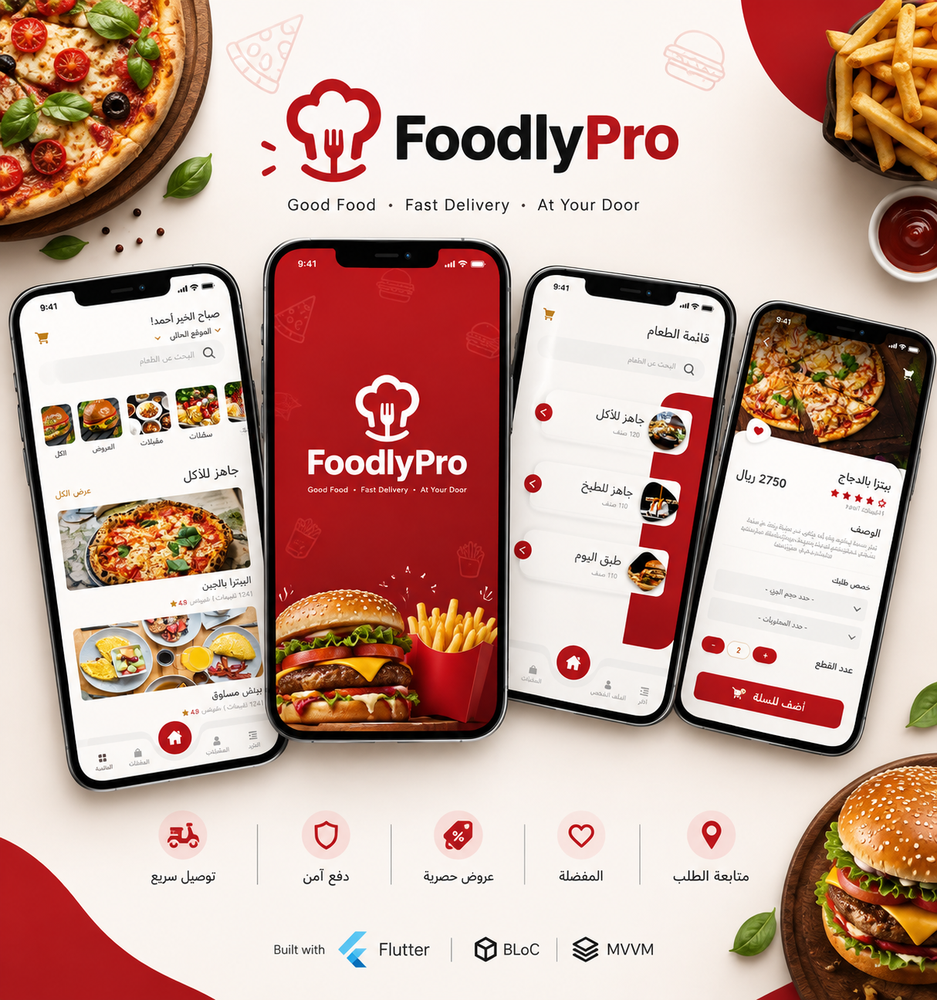

# 🍔 FoodlyPro — Food Ordering & Delivery App

FoodlyPro is a modern food ordering and delivery mobile application built with Flutter. The app provides a complete food-ordering experience, allowing users to browse meals, customize their orders, manage their cart, and place orders through an intuitive and responsive interface.

The project was developed using BLoC for state management and MVVM architecture to ensure a clean, scalable, and maintainable codebase.

---

## 📱 Overview

FoodlyPro is designed for restaurants and food businesses that want to provide customers with a seamless digital ordering experience.

The application includes features commonly found in modern food delivery applications, such as:

- 🍔 Browse food categories and products
- 🔎 Search for meals and products
- 🥘 View detailed product information
- 🛒 Add and manage products in the cart
- ➕ Customize product quantities
- 💰 Calculate order totals
- 📦 Place and track orders
- 👤 Manage user profile
- 📍 Manage delivery information
- ❤️ Favorite products
- 🔐 User authentication
- 🔔 Notifications
- 🌐 Multi-language support
- 📱 Responsive UI for different screen sizes

---

## ✨ Features

### 🔐 Authentication

- User registration
- Login
- Logout
- Authentication state management
- Form validation
- Secure handling of user session data

### 🏠 Home

- Modern restaurant/food ordering interface
- Featured products
- Food categories
- Popular meals
- Promotional sections
- Quick access to products and categories

### 🍕 Food Categories

Users can explore different food categories and browse the available products.

Examples:

- Burgers
- Chicken
- Meals
- Sandwiches
- Desserts
- Drinks
- Offers

### 🔎 Search

- Search for meals and products
- Dynamic search results
- Easy access to product details

### 🍔 Product Details

Each product provides detailed information including:

- Product image
- Name
- Description
- Price
- Available options
- Quantity selection
- Add to cart

### 🛒 Shopping Cart

Users can easily manage their orders through the shopping cart.

Features include:

- Add products
- Remove products
- Increase/decrease quantity
- Calculate subtotal
- Calculate total price
- Review the complete order before checkout

### 📦 Orders

Users can:

- Place new orders
- View previous orders
- View order details
- Track order status

### ❤️ Favorites

Users can save their favorite meals for quick access later.

### 👤 Profile

Users can manage their account information, including:

- Personal information
- Profile data
- Delivery information
- Account settings

### 📍 Delivery

The application supports delivery-related information such as:

- Delivery address
- Customer information
- Order delivery details

### 🔔 Notifications

The application supports notifications for important user and order-related updates.

### 🌐 Localization

The application is designed to support multiple languages and provide a localized user experience.

### 📱 Responsive Design

The UI is designed to work across different mobile screen sizes while maintaining a consistent user experience.

---

## 🏗️ Architecture

FoodlyPro follows the MVVM (Model–View–ViewModel) architecture pattern.

```text
lib/
│
├── core/
│   ├── constants/
│   ├── errors/
│   ├── network/
│   ├── services/
│   ├── utils/
│   └── ...
│
├── data/
│   ├── models/
│   ├── datasources/
│   └── repositories/
│
├── presentation/
│   ├── views/
│   ├── view_models/
│   ├── widgets/
│   └── ...
│
└── main.dart
```

The architecture separates:

- **Model** — Responsible for representing application data and API responses.
- **View** — Responsible for displaying the UI and interacting with the user.
- **ViewModel** — Responsible for presentation logic and coordinating between the UI and application data.

This separation makes the project easier to:

- Maintain
- Test
- Extend
- Debug
- Scale

---

## 🔄 State Management

The application uses BLoC (Business Logic Component) for state management.

BLoC separates business logic from the UI and provides predictable state transitions.

Example flow:

```text
User Action
     ↓
   Event
     ↓
    BLoC
     ↓
Business Logic
     ↓
   New State
     ↓
    UI Update
```

BLoC is used for managing different application states such as:

- Authentication
- Products
- Categories
- Cart
- Favorites
- Orders
- Profile
- Loading states
- Error states

---

## 🌐 API Integration

The application is structured to communicate with backend APIs for retrieving and managing application data.

API-related functionality includes:

- Authentication
- Products
- Categories
- User information
- Cart
- Orders
- Favorites
- Notifications

The networking layer is separated from the presentation layer to keep the application modular and maintainable.

---

## 🛠️ Technologies & Tools

| Technology | Usage |
|---|---|
| Flutter | Cross-platform mobile development |
| Dart | Programming language |
| BLoC | State management |
| MVVM | Architecture |
| Dio | HTTP/API communication |
| REST API | Backend communication |
| SharedPreferences | Local data persistence |
| Git & GitHub | Version control |

---

## 🎨 UI & UX

FoodlyPro focuses on providing a simple and intuitive ordering experience.

The UI includes:

- Clean modern design
- Reusable widgets
- Responsive layouts
- Consistent spacing and typography
- Product-focused interfaces
- Smooth navigation
- Loading and error states
- User-friendly ordering flow

---

## 🚀 Key Technical Highlights

- Implemented MVVM architecture for clean separation of concerns.
- Used BLoC to manage application state and business logic.
- Built reusable and modular Flutter widgets.
- Integrated RESTful APIs using Dio.
- Implemented authentication and user session handling.
- Developed product browsing and category navigation.
- Implemented cart and order management.
- Added favorites functionality.
- Implemented responsive UI for different screen sizes.
- Separated networking, data, business logic, and presentation layers.
- Focused on maintainable and scalable Flutter code.

---

## 📸 Screenshots

Add screenshots of the application here:

```text
screenshots/
├── home.png
├── categories.png
├── product_details.png
├── cart.png
├── checkout.png
├── orders.png
└── profile.png
```

Example: **FoodlyPro Home** (`screenshots/home.png`)

---

## ⚙️ Getting Started

### Prerequisites

Make sure you have installed:

- Flutter SDK
- Dart SDK
- Android Studio or VS Code
- Android/iOS development environment

### Installation

Clone the repository:

```bash
git clone https://github.com/toqua1/FoodlyPro.git
```

Navigate to the project:

```bash
cd FoodlyPro
```

Install dependencies:

```bash
flutter pub get
```

Run the application:

```bash
flutter run
```

---

## 📂 Project Goals

The main goal of FoodlyPro was to build a production-style food ordering application while applying clean Flutter development practices.

The project demonstrates experience with:

- Flutter application development
- State management with BLoC
- MVVM architecture
- REST API integration
- Local storage
- Responsive UI
- Modular application structure
- E-commerce ordering flows

---

## 👩‍💻 Developer

Flutter Developer

Built with ❤️ using Flutter & Dart.

---

## ⭐ Support

If you find this project useful or interesting, consider giving the repository a ⭐ on GitHub.
